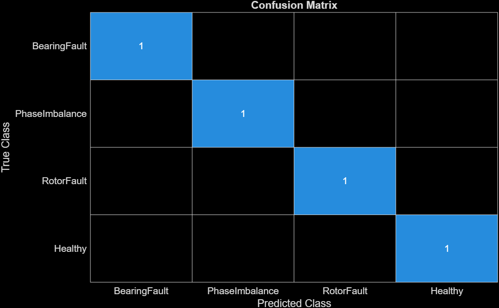
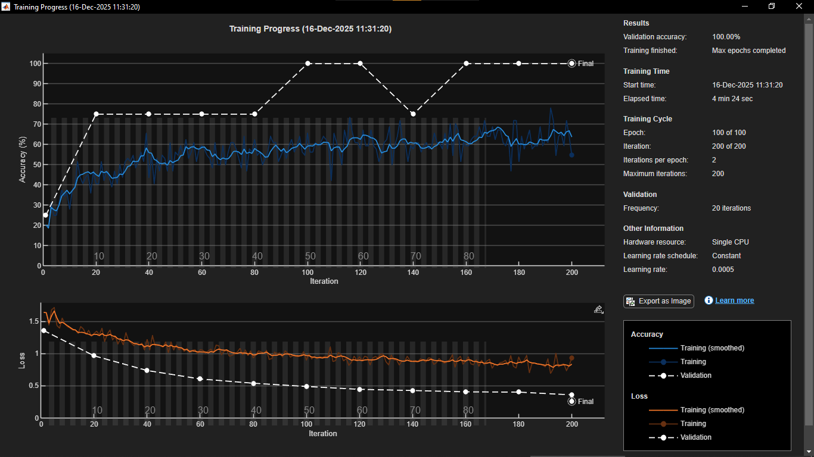

# SnS Project — Motor Fault Classification (MATLAB, 1D-CNN)

This project trains a 1D convolutional neural network to classify induction motor conditions from electrical signals (three‑phase currents) and auxiliary channels (Torque, RPM). Data are CSV exports from Simulink.

## Table of Contents
- [Overview](#overview)
- [Project Structure](#project-structure)
- [Dataset](#dataset)
- [Model](#model)
- [Training](#training)
- [Evaluation](#evaluation)
- [Results](#results)
- [Reproducibility](#reproducibility)
- [Troubleshooting](#troubleshooting)

## Overview
- Goal: Classify motor states — Healthy, BearingFault, RotorFault, PhaseImbalance — from time‑series.
- Input: Multi‑channel windows of length `inputLength` (default examples below use 4096).
- Channels: Ia, Ib, Ic, Torque, RPM (5 channels).
- Highlights: CSV loader, overlapping windows, stratified and balanced splits, basic augmentations.

## Project Structure
- [data/simulink](data/simulink): CSV dataset (one or more files per class)
- [graphs](graphs): Figures produced during experiments (confusion matrix, training curves)
- [model](model): MATLAB source
	- [create1DCNN.m](model/create1DCNN.m): Builds the 1D‑CNN. Input shape `[L × 1 × C]`.
	- [loadDataset.m](model/loadDataset.m): Loads CSVs, generates overlapping windows, stratifies and balances splits.
	- [augmentSignals.m](model/augmentSignals.m): Noise/scale/shift augmentations applied across channels.
	- [trainModel.m](model/trainModel.m): Orchestrates training with `trainNetwork` and saves the model.
	- [evaluateNetwork.m](model/evaluateNetwork.m): Accuracy, per‑class precision/recall, confusion chart.
	- [generate_synthetic_data.m](model/generate_synthetic_data.m): Synthetic data fallback for quick testing.

## Dataset
- Location: CSVs placed under [data/simulink](data/simulink).
- Expected columns (header order): `Time, Ia, Ib, Ic, Torque, RPM`.
	- If headers exist, loader finds `Ia`, `Ib`, `Ic`, and optionally `Torque`/`RPM`.
	- If headers are missing, it assumes the order above.
- Label inference: From filename (case‑insensitive):
	- `healthy → Healthy`
	- `bearingfault → BearingFault`
	- `rotorfault → RotorFault`
	- `phaseimbalance → PhaseImbalance`
- Windowing: Each CSV is sliced into overlapping windows of length `inputLength` with 50% overlap (stride = `inputLength/2`).
- Splitting: Stratified 80/20 split. Validation is class‑balanced (downsampling); training is oversampled to balance classes.

## Model
- Input layer: `[inputLength × 1 × C]` where `C ∈ {1,3,5}` (here: 5 channels = Ia,Ib,Ic,Torque,RPM).
- Backbone: Lightweight 1D‑CNN implemented via 2D conv layers of width 1, with pooling and GAP.
- Output: Softmax over detected classes.

## Training
Open MATLAB in this project folder, then run one of the following:

Baseline windowed training (recommended)
```matlab
net = trainModel('dataDir','data/simulink', ...
				 'inputLength',4096, ...
				 'epochs',100, ...
				 'augmentFactor',2, ...
				 'miniBatchSize',64, ...
				 'learnRate',5e-4);
```

Full‑length training (uses entire 10,001‑sample files if desired)
```matlab
net = trainModel('dataDir','data/simulink', ...
				 'inputLength',10001, ...
				 'epochs',100, ...
				 'augmentFactor',2, ...
				 'miniBatchSize',64, ...
				 'learnRate',5e-4);
```

Notes
- Augmentation: Adds light Gaussian noise, scaling, and small circular shifts applied consistently across channels.
- Execution: Defaults to CPU. To use GPU, change `trainingOptions` in [trainModel.m](model/trainModel.m).

## Evaluation
After training, the script prints metrics and opens a confusion matrix.

Example code to evaluate a saved network on validation data:
```matlab
load trained1dcnn.mat  % loads variable `net`
[XTrain,YTrain,XVal,YVal] = loadDataset('data/simulink',4096,0);
metrics = evaluateNetwork(net,XVal,YVal);
```

## Results
- Confusion matrices and plots can be stored under [graphs](graphs). Example placeholders:
	- Confusion matrix (validation): 
	- Training progress: 

If your filenames differ, update the image references or save figures programmatically with `saveas`.

## Reproducibility
- MATLAB: R2020b+ recommended (Deep Learning Toolbox). Image Processing Toolbox is used for a minor transform.
- Determinism: For exact reproducibility, set `rng(seed)` before loading and training.
- Data balance: Loader performs stratified splitting and balances train/val; disable or modify in [loadDataset.m](model/loadDataset.m) if you need raw distributions.

## Troubleshooting
- Labels missing or incorrect:
	- Ensure filenames contain the class keyword (e.g., `healthy`, `rotorfault`).
	- Verify CSV headers include `Ia, Ib, Ic`; otherwise the fallback column order is used.
- Small validation size:
	- Add more CSVs per class or reduce window length to create more windows.
- Slow training:
	- Use shorter `inputLength` (e.g., 2048/4096) and/or reduce overlap by changing stride in the loader (default = 50% in [loadDataset.m](model/loadDataset.m)).

