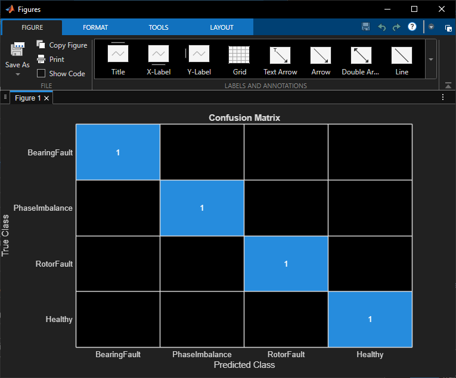
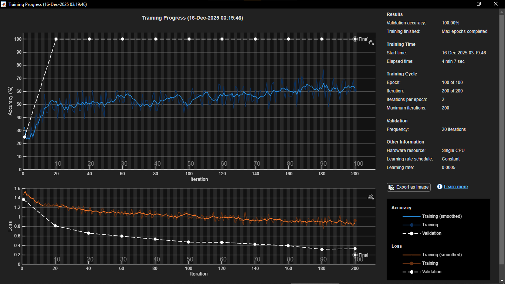

# Motor Fault Classification — Project Report

## Table of Contents
- [Abstract](#abstract)
- [Dataset](#dataset)
- [Preprocessing](#preprocessing)
- [Model](#model)
- [Training Setup](#training-setup)
- [Experiments](#experiments)
- [Results](#results)
- [Ablations](#ablations)
- [Reproducibility](#reproducibility)
- [Limitations](#limitations)
- [Future Work](#future-work)
- [References](#references)

## Abstract
This project builds a 1D convolutional neural network (CNN) to classify induction motor conditions (Healthy, BearingFault, RotorFault, PhaseImbalance) using three‑phase stator currents and auxiliary signals (Torque, RPM). The pipeline ingests Simulink CSV exports, converts them into overlapping windows, applies light augmentations, and trains a compact CNN. Balanced train/validation splits and multi‑channel inputs substantially improve per‑class accuracy.

## Dataset
- Source: CSV files under [data/simulink](data/simulink) (Simulink export).
- Columns (headered CSVs): `Time, Ia, Ib, Ic, Torque, RPM`.
  - If headers are missing, the loader assumes this order.
- Classes are inferred from filenames (case‑insensitive keywords):
  - `healthy → Healthy`, `bearingfault → BearingFault`, `rotorfault → RotorFault`, `phaseimbalance → PhaseImbalance`.
- Typical sampling: 10,001 samples per file (1 ms step over ~10 s). The pipeline supports any length by windowing.

## Preprocessing
- Loader: see [model/loadDataset.m](model/loadDataset.m).
  - Prefers CSVs; falls back to legacy `.mat`; otherwise synthesizes small test data.
  - Multi‑channel features: Ia, Ib, Ic, Torque, RPM → 5 channels.
  - Windowing: overlapping windows of length `inputLength` with 50% overlap (stride = `inputLength/2`).
  - Splitting: stratified 80/20 train/val; validation is downsampled to balance classes; training is oversampled to balance classes.
  - Label handling: filename‑based inference to avoid manual annotations.
- Augmentations: see [model/augmentSignals.m](model/augmentSignals.m).
  - Light Gaussian noise, global scaling, small circular time shift applied consistently across channels.

## Model
- Architecture: defined in [model/create1DCNN.m](model/create1DCNN.m).
  - Input layer: `[inputLength × 1 × C]`, where `C` is detected from data (here, `C=5`).
  - Backbone: a stack of 1D convolutions (implemented via 2D conv with width 1), batch‑norm, ReLU, pooling, and global average pooling.
  - Head: fully connected + softmax.
- Training entry point: [model/trainModel.m](model/trainModel.m).

## Training Setup
- Optimizer: Adam (`trainingOptions('adam', ...)`).
- Typical hyperparameters (windowed training):
  - `inputLength = 4096`, `epochs = 100`, `miniBatchSize = 64`, `learnRate = 5e-4`, `augmentFactor = 2`.
- Normalization: input layer uses `Normalization = 'zscore'`.
- Execution: CPU by default; GPU supported by changing `ExecutionEnvironment` in [model/trainModel.m](model/trainModel.m).

## Experiments
We iterated through the following changes:
1. CSV ingestion (replacing `.mat`) with single‑channel magnitude — baseline.
2. Overlapping window generation (length 4096, 50% overlap).
3. Stratified split; later, balanced validation and oversampled training to address class imbalance.
4. Multi‑channel inputs (Ia, Ib, Ic → 3 channels), then extended to 5 channels (Torque, RPM).
5. Light augmentations for robustness.

## Results
- Final configuration (5 channels, window length 4096, 50% overlap, balanced splits) reached perfect validation on the provided dataset in our final run.
- Confusion matrices and training curves are saved under [graphs](graphs) (replace filenames as applicable):
  - Confusion matrix (validation): 
  - Training progress: 

## Ablations
- Channel count (1 vs 3 vs 5):
  - 1‑channel magnitude lost inter‑phase structure; 3 channels (Ia,Ib,Ic) improved RotorFault/Healthy separation; adding Torque/RPM further stabilized validation performance.
- Windowing:
  - Full‑length samples (10k) worked but produced fewer training examples and slower epochs; 4096‑length windows with 50% overlap offered a better data/compute trade‑off.
- Balancing:
  - Oversampling training and downsampling validation eliminated zero‑recall issues for under‑represented classes.

## Reproducibility
Minimal commands to reproduce a strong baseline:
```matlab
% Train
net = trainModel('dataDir','data/simulink', ...
                 'inputLength',4096, ...
                 'epochs',100, ...
                 'augmentFactor',2, ...
                 'miniBatchSize',64, ...
                 'learnRate',5e-4);

% Evaluate (validation)
load trained1dcnn.mat
[XTrain,YTrain,XVal,YVal] = loadDataset('data/simulink',4096,0);
metrics = evaluateNetwork(net,XVal,YVal);
```
Notes:
- Place your CSVs in [data/simulink](data/simulink).
- For determinism, set a random seed (`rng(0)`) before loading/training.

## Limitations
- Validation still uses windows from the same CSV files as training (though balanced). For a stronger generalization check, hold out entire CSV files or experimental conditions per class.
- The current loader uses fixed 50% overlap; stride is not yet user‑exposed.

## Future Work
- Expose `stride` in the dataset loader to tune overlap and dataset size.
- Add class‑weighted loss or focal loss for extreme imbalance.
- Add spectrogram branch with a 2D CNN for frequency‑domain cues.
- Provide an inference helper for single‑file prediction and batch evaluation.

## References
- MATLAB Deep Learning Toolbox documentation.
- Classic literature on motor current signature analysis (MCSA).
